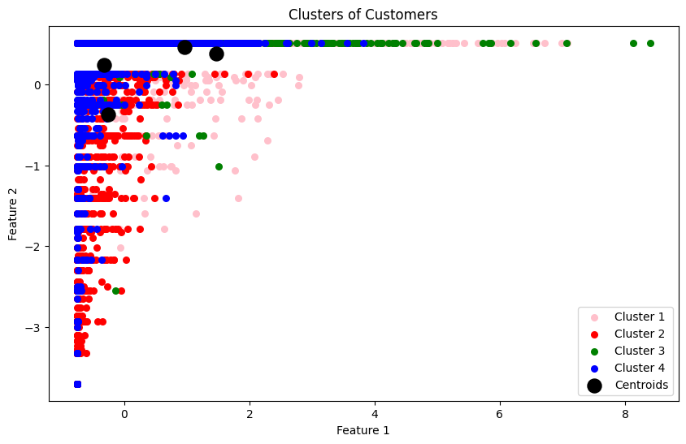

# AIPROJECT.286981
# SHOPEASY PROJECT

## Team Members
- Lucrezia Salerno 
- Elisa Presciutti
- Irma Di Nallo

## Section 1 - Introduction
The project is an analysis of the ShopEasy dataset. The initial step is understanding the column meanings. To do this multiple libraries are imported such as NumpyPy, pandas, Matplotlib, seaboard, os, and requests. The reason as to why these specific libraries need to be imported is also to manipulate, analyse, and visualise the data. The primary dataset for analysis is ‘shopeasy.csv’ which contains various keys and their values. Each column in the dataset is described in detail, providing insights into various features like ‘personalID’, ‘accountTotal’, ‘frequencyIndex’, ect. Which provides a data overview and understanding of the dataset.

After having visualised the data it can be seen that some of the data is missing therefore we use the tool “missingno’ to see the missing data patterns. We also use various plots such as matrix plot to analyse this missing data. techniques like pair plots and count plots are utilised for a deeper understanding of relationships between variables.The project explores data duplication and methods to address it. Clustering methods (K-means, Hierarchical Clustering, DBSCAN) are applied to the dataset. This includes finding the optimal number of clusters and evaluating clustering performance using metrics like silhouette score, Calinski-Harabasz index, and Davies-Bouldin index.  The analysis concludes with the indication that DBSCAN might be a preferable method for clustering in this context, due to its performance on certain evaluation metrics.

## Section 2 - Methods
The primary step was to thoroughly understand the dataset through EDA. This involves understanding column meaning, therefore analysing each column to understand the type of data and its significance in the context of e-commerce user behaviour. 
We also needed to perform a data integrity check ensuring the dataset's quality by checking for missing values, duplicates, and anomalies. Using the missingno library for visualising the pattern of missing data. Finally we used clustering for data analysis. 
K-means Clustering: Used for segmenting users based on various factors. K-means clustering is used as a strategic tool for understanding and categorising customer behaviour, aiding in targeted marketing, personalised services, and informed business decision-making. The method's effectiveness is evaluated against other clustering techniques to ensure the best possible approach is utilised for the dataset in question.
Hierarchical Clustering: Unlike K-means, hierarchical clustering doesn't require pre-specifying the number of clusters. It builds a hierarchy of clusters and is particularly useful for understanding the underlying data structure. It serves to provide a detailed and nuanced understanding of the dataset, offering a different perspective compared to other clustering methods. It aids in granular segmentation, visual representation of data structure, and comparative analysis, contributing to a comprehensive understanding of customer behaviour and informed decision-making.
DBSCAN: used to handle outliers effectively, identify clusters of arbitrary shapes, simplify the process of model parameterisation, and provide a different perspective in the comparative analysis of clustering methods. It’s unique approach to clustering based on data density offers valuable insights, especially in complex or spatially influenced datasets.

## Section 3 - Experimental Design 
Experiment: Clustering Techniques Comparison

Main Purpose: 
To compare different clustering techniques (K-means, Hierarchical Clustering, and DBSCAN) for segmenting customers based on their shopping behaviour and preferences.
To identify the most effective clustering method for this specific e-commerce dataset.

What we used:K-means Clustering: Serves as a baseline with its standard approach of partitioning the data into k clusters, where each data point belongs to the cluster with the nearest mean.
Hierarchical Clustering: Another baseline that provides an alternative approach, building a hierarchy of clusters and allowing the examination of cluster formations at different levels.

Evaluation Metrics:
Silhouette Score: Used to measure how similar an object is to its own cluster compared to other clusters. A high silhouette score indicates well-separated and densely packed clusters.
Calinski-Harabasz Index: Measures the variance ratio between clusters, with a higher score indicating better-defined clusters.
Davies-Bouldin Index: Evaluates the average similarity between clusters, where lower values indicate better clustering.

2. Experiment: Missing Data Handling

Main Purpose:
To evaluate different strategies for handling missing data in the dataset, ensuring data integrity and quality for accurate analysis.

To assess the impact of missing data treatment on the subsequent clustering results.

What we used:
Row Deletion: Removing rows with missing values, serving as a basic baseline.
Mean/Median/Mode Imputation: Replacing missing values with the mean, median, or mode of the respective column.

Evaluation Metrics:
Data Completeness: Post-treatment data integrity, assessing how much of the original data is retained or accurately imputed.
Impact on Results: Observing changes in clustering outcomes (using the above metrics) post missing data treatment.

3. Experiment: Data Preprocessing

Main Purpose:
To explore the impact of different data preprocessing techniques and feature engineering on the effectiveness of the clustering models.
To enhance the clustering model's performance by optimising input features.

Baselines:
Raw Data: Using the dataset without any preprocessing as a baseline.
Standard Preprocessing: Basic preprocessing steps like normalisation and handling categorical variables.
Evaluation Metrics:
Model Performance Metrics: Same as above (Silhouette Score, Calinski-Harabasz Index, Davies-Bouldin Index) to assess the impact of preprocessing on clustering performance.
Feature Importance: Assessing which features contribute most significantly to the clustering outcomes.

These experiments collectively aim to optimise the clustering approach for the project, ensuring the most effective segmentation of customers for enhanced business insights and decision-making. The choice of evaluation metrics aligns with the goal of achieving distinct, well-separated clusters that accurately represent the underlying customer segments in the dataset.

## Section 4-  Results 
Among the clustering methods (K-means, Hierarchical, and DBSCAN) tested, DBSCAN showed the most promising results in terms of forming well-defined and meaningful clusters. 

This was indicated by the highest Silhouette Score and lowest Davies-Bouldin Index, suggesting better-defined and compact clusters. K-means was effective for general segmentation but lacked the flexibility in identifying clusters of arbitrary shapes and handling noise and outliers as effectively as DBSCAN. 

Hierarchical Clustering provided valuable insights into the hierarchical structure of the data but was less effective in clearly delineating distinct customer segments compared to DBSCAN. Strategies for handling missing data significantly influenced the clustering results. 

Imputation methods were found to be more effective than row deletion, preserving data integrity and leading to more reliable clustering outcomes. Visualisations like Missingno matrix plots and bar charts were crucial in understanding the pattern of missing data, guiding effective data imputation strategies. Data preprocessing techniques, including normalisation and handling of categorical variables, played a critical role in enhancing the performance of clustering models. Feature engineering, particularly the selection and transformation of relevant features, significantly impacted the clustering results.

## Section 5 - Conclusions 
The project's main conclusion centres around the effectiveness of DBSCAN in clustering, which emerged as the most efficient method due to its superior handling of noise and ability to identify clusters with arbitrary shapes. This characteristic of DBSCAN proves especially valuable in the e-commerce domain where customer behaviours and interactions can form complex, non-linear patterns that are not adequately captured by more traditional clustering methods like K-means.

Additionally, the project highlighted the crucial role of data preprocessing and missing data treatment. Effective strategies for handling missing data, particularly through imputation methods like mean, median, or mode replacement, were found to be more advantageous compared to simple row deletion. These strategies ensured the integrity and completeness of the data, leading to more reliable clustering outcomes. Moreover, preprocessing steps such as normalisation and careful handling of categorical variables were instrumental in enhancing the clustering models' performance, underscoring the importance of proper data preparation in machine learning projects.

A key takeaway from the project is the importance of choosing the right clustering technique and data treatment method based on the specific characteristics of the dataset. The insights derived from the clustering analysis have significant implications for targeted marketing strategies and customer relationship management in e-commerce. By understanding the distinct segments within the customer base, businesses can tailor their marketing efforts more effectively, personalise customer experiences, and ultimately drive better business outcomes.
